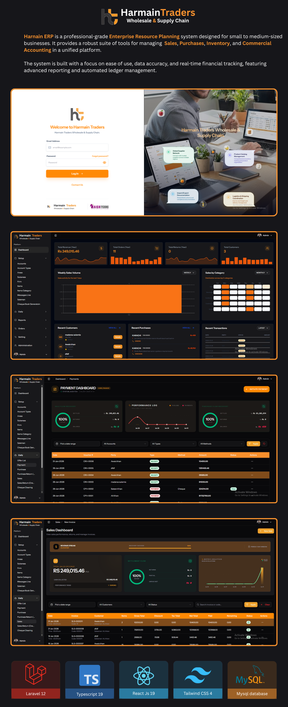

# 🚀 Harnain ERP – Business Management & Accounting System


---

## 📘 Overview

**Harnain ERP** is a professional-grade **Enterprise Resource Planning** system designed for small to medium-sized businesses. It provides a robust suite of tools for managing **Sales**, **Purchases**, **Inventory**, and **Commercial Accounting** in a unified platform.

The system is built with a focus on ease of use, data accuracy, and real-time financial tracking, featuring advanced reporting and automated ledger management.

---

## 🚀 Technology Stack

### **Backend**

- **Framework:** Laravel 12.x
- **Database:** MySQL / PostgreSQL
- **PDF Generation:** barryvdh/laravel-dompdf
- **Excel Support:** Maatwebsite Excel
- **Auth:** Laravel Fortify (with Sanctum)
- **Permissions:** Spatie Laravel Permission

### **Frontend**

- **Framework:** React 19
- **Adapter:** Inertia.js 2.0 (Server-side rendering support)
- **Styling:** Tailwind CSS 4.0
- **UI Components:** Shadcn UI (Radix UI)
- **State Management:** Inertia State / React Hooks
- **Data Visualization:** Recharts
- **Forms & Validation:** Zod + React Hook Form

---

## ✨ Key Features

- **Inventory Management** — Track items, categories, and stock levels in real-time.
- **Sales & Purchase Suite** — Manage sales orders, invoices, purchase bills, and returns functionality.
- **Financial Accounting** — Comprehensive Chart of Accounts, Ledgers, and clear Payment Allocations.
- **Banking & Cheques** — Integrated chequebook management and banking transaction tracking.
- **Role-Based Access (RBAC)** — Granular permissions for admins, salesmen, and accountants.
- **Reporting & Business Intelligence** — Interactive dashboards with analytics and printable PDF reports.
- **Responsive Design** — Fully optimized for both light and dark modes with a premium aesthetic.

---

## 📂 Project Structure

```txt
Harnain/
├── app/
│   ├── Http/Controllers/   # Sales, Purchase, Account, Bank controllers
│   └── Models/             # Item, Sale, Purchase, Account, etc.
├── resources/
│   ├── js/
│   │   ├── components/     # UI elements (Shadcn UI)
│   │   ├── pages/          # Inertia Views (Daily Ops, Setup, Reports)
│   │   └── types/          # TypeScript definitions
├── database/
│   ├── migrations/         # ERP schema definition
│   └── seeders/            # Demo data and configuration
└── routes/
    └── web.php             # Web & ERP Logic routes
```



---

## 🛠️ Setup Instructions

### Prerequisites

- **PHP** 8.2 or higher
- **Composer** 2.x
- **Node.js** 20+ & **NPM**
- **MySQL** 8.0 or **MariaDB**

### 1. Clone & Install

```bash
git clone <repository-url>
cd Harnain
composer install
npm install
```

### 2. Environment Configuration

```bash
cp .env.example .env
php artisan key:generate
```

> [!NOTE]
> Update your `.env` file with your database credentials and application URL.

### 3. Database Migration

```bash
php artisan migrate --seed
```

### 4. Development Workflow

The project uses a custom script to run the server, queue, and vite concurrently:

```bash
composer run dev
```

Alternatively, run them separately:

- `php artisan serve`
- `npm run dev`

---

<div align="center">

**Harnain ERP** — Empowering Business with Precise Accounting.

Made with ⚙️ by Fayyaz Ahmed

</div>
